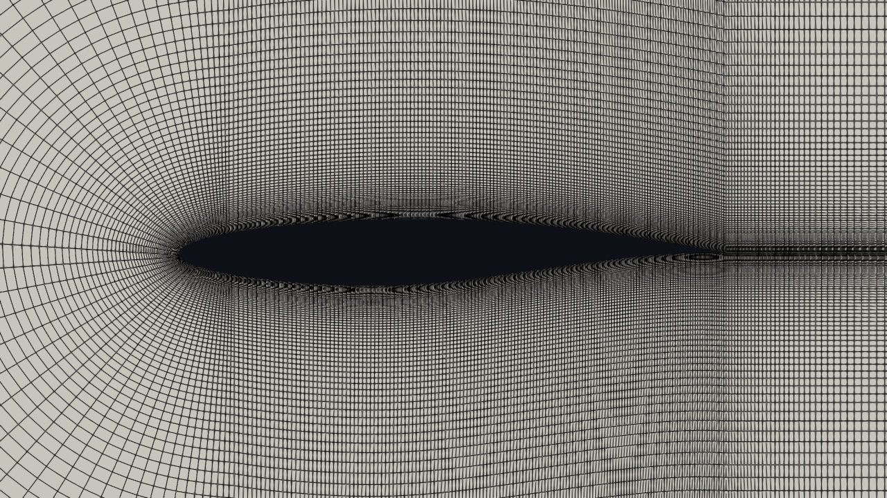
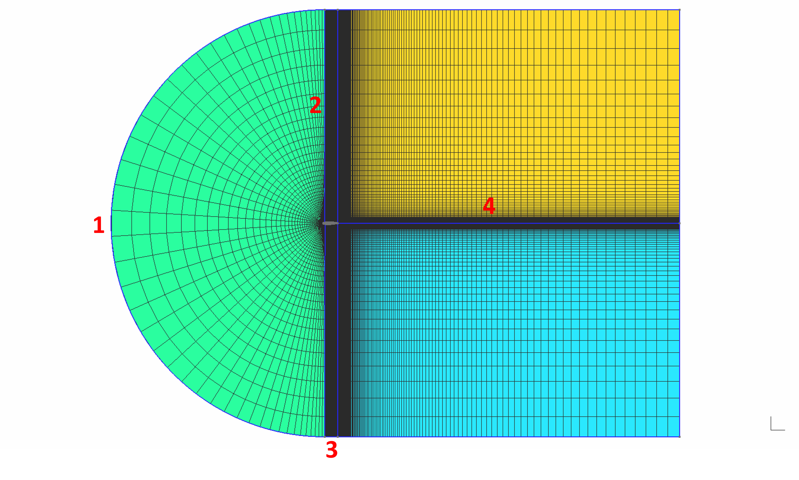

wuFoil
======

wuFoil is an open sourced all in one airfoil modelling, analysis and optimization tool. The code automates the process 
of mesh generation using gmsh and aerodynamic analysis using either xfoil or SU2 allowing for operations such as 
optimization and rapid sampling for machine learning databases.


Author: Mike Kiely (K.mike@Wustl.edu)

---
Features
---

- Airfoil modelling from coordinate data files or CST Variables
- Automatic c-blockmesh generation with gmsh

   

- Automated Simulation runs in SU2 CFD or xfoil
- Airfoil Optimization
- Parallelized batch simulations

---
Using The Code
---
### Airfoil Modelling and Interpolation
To get started simply ensure that the datafile for the airfoil you wish to model is saved in your current working 
directory and create an airfoil using the wuFoil.Airfoil command. Both Selig format and Lednicer format work in importing
airfoils. In this line you can also edit the chord length and name of the airfoil. Note that the name of the airfoil is 
important because it will be used as the prefix for all output files. Use the Airfoil.plot_airfoil function to visualize 
the airfoil you just initialized, changing the show_plot input to true to show the plot.

Interpolation in wuFoil is handled using 3rd degree b-spline curves of both the top and bottom surfaces. A recursive loop
is used to increase resolution at the leading edge where additional points are added until the angle at the leading edge 
is within a certain tolerance of 180 degrees, typically ~173-175 degrees produces a good resolution. To use this feature,
use the Airfoil.interpolate_airfoil feature.

Finally, use the Airfoil.set_tc_camber function to find the maximum thickness and camber of the airfoil.

The following example code uses the RAE 2822 airfoil stored in a file called 'rae2822.dat'. The airfoil is interpolated
and then plotted against the original data points. Finally, the thickness and camber are found and printed to the screen.

```python
import wuFoil as wf

af = wf.Airfoil('rae2822.dat', chord_length=1, name='airfoil')
af.plot_airfoil(show_plot=False, linestyle='o')    # don't show the plot yet. linestyles are set based on typical matplotlib syntax
af.interpolate_airfoil(n_points=100)    # note that n_points sets the number of points on both the bottom and top surfaces
af.plot_airfoil(show_plot=True)
af.set_tc_camber()

print(f'Maximum Camber {af.max_camber} at location x/c = {af.x_mc}')
print(f'Maximum Thickness {af.max_thickness} at location x/c = {af.x_tc}')
```

### CST Airfoils
The CST Parameterization method is a method that uses a family of weighted Bernstein to model airfoils. This technique is
highly advantageous for modelling airfoils for a variety of reasons, for more information see the Kulfan's orginal paper,
'[A Universal Parametric Geometry Representation Method - "CST"](https://doi.org/10.2514/6.2007-62)'. This method is used
mainly used for optimization and modelling using machine learning regression methods. To initialize a cst airfoil, simply 
use initiate an object of the class wuFoil.cst_Airfoil with a list of cst variables [a0, a1, ... an] along with the previously
explained parameters. Note that cst variables are formatted as a list with the lower cst variables first then the upper 
cst variables. Any amount of cst variables can be used with even numbers representing a trailing edge y/c value of 0
and odd numbers representing the y/c value at the trailing edge with the last value.

Alternatively, the CST variables of an airfoil initialized using a data file can be found using the wuFoil.get_cst_variables
function. This method uses scipy's SLSQP optimization method to set the CST variables until the convergence value titled 'tol'
is reached. Additionally, you can choose to plot the CST airfoil against the initial points to ensure convergence.

The following example code demonstrates these functions using the RAE 2822 airfoil.

```python
import wuFoil as wf

af = wf.Airfoil('rae2822.dat')
# get cst variables for rae2822
a = wf.get_cst_variables(af, tol=1e-9, n_vars=9, plot_airfoil=True, a_guess=None)
# Create new airfoil with these CST variables
af = wf.cst_Airfoil(a, chord_length=1, name='RAE_2822_CST')
```

### Meshing
A traditional structured C-Block mesh can be generated around the airfoil automatically using gmsh. The mesh parameters 
are customizable in the Airfoil.mesh_parameters variable by altering the following sections. Note that all values are normalized
by the chord length

- 1: Inlet and airfoil leading edge. Change number of points with mesh_parameters.n_leading_edge
- 2: C-Block Volume mesh. Change number of points with n_volume and boundary layer thickness with first_cell_thickness. Alternatively, set the boundary layer thickness to a desired y+ value with the function Airfoil.set_desired_yplus
- 3: Airfoil top and bottom surfaces, domain top and bottom. Change number of points with n_airfoil
- 4: Downstream mesh. Change number of points with n_wake and desired cell thickness at the trailing edge with trailing_edge_thickness

The default mesh is a relatively fine mesh with ~80,000 elements that extends 15 chord lengths upstream and 25 
downstream. If you set the y+ for your case with the Airfoil.set_desired_yplus to 1 this should be a robust mesh that works
for most cases. The following example code shows the process of meshing an RAE 2822 airfoil and changing some of the 
default parameters.

```python
import wuFoil as wf

af = wf.airfoil('rae2822')
af.set_flight_conditons(35000, .78, input_units='ft')   # must be run before setting the y+ value
af.mesh_parameters.downstream_distance = 15
af.mesh_parameters.n_airfoil = 125
af.set_desired_yplus(1)
af.generate_mesh()
```
### Analysis
#### SU2
Running an SU2 analysis requires the user to first set the flight conditions (altitude and mach) and generate the mesh 
before initializing the analysis using the SU2_Analysis Class. It is assumed that the SU2_RUN environment variable has
been added to the path as explained in the installation instructions [here](https://su2code.github.io/docs_v7/SU2-Windows/).
Analysis methods such as the solver, turbulence model, convergence criteria, and max iterations can be altered using this
class. If you want to change additional variables not included in the class definition, you will need to create your own
su2 .cfg file and set the Analysis.base_cfg variable to its file name. Note that for both analysis methods either cl or the 
angle of attack aoa must be specified

#### xfoil
Running an xfoil analysis works essentially exactly the same as an SU2 analysis with a few key changes, namely significantly 
less solver variables. Additionally, the mesh does not need to be generated for an xfoil analysis and the transition locations
are calculated on the top and bottom surfaces. A list of cl's or aoa's can also be passed as an argument for an xfoil analysis,
evaluating the airfoil at each. An example of each type of analysis can be seen below.

```python
import wuFoil as wf

af = wf.airfoil('rae2822', chord_lenght=1, name='rae2822')
# Set flight conditions. Note: input units must be 'ft' or 'm' and must stay consistent with chord length
af.set_flight_conditons(altitude=35000, mach=0.78, input_units='ft', cl=.7)
af.generate_mesh(hide_output=True, show_graphics=False) # Hide all gmsh output

# Run SU2 analysis
analysis = wf.SU2_Analysis(af)
analysis.n_processes = 8    # number of processors used for parallel processes
analysis.convergence = -6   # convergence criteria, log10(rms(rho)) by default
analysis.run_analysis()
print(f'Cl = {analysis.cl}, Cd = {analysis.cd}')

# Run xfoil analysis at different angles of attack
analysis = wf.xfoil_analysis(af, interp_points=200)
aoa = [0, 1, 2, 3, 4, 5]
analysis.run_analysis(aoa=aoa)
for i, angle in enumerate(aoa):
    print(f'Angle of attack = {angle} deg, cl = {analysis.cl[i]}, cd = {analysis.cd[i]}')
```
### Parallel processing and batch analysis
Several airfoils at once can be analyzed using python's MultiProcessing library using the analyze_batch function. To do this,
each airfoil must be fully initialized then passed into the function as a part of a list. An example of this code can be 
seen below. Analysis variables can be altered using the analysis_parameters parameter. Additionally, the results can be 
printed to a csv file for further analysis. For a script used to sample random CST airfoils for use in a machine learning
database, see Scripts/Parallel_Sampling.

A few notes on outputting to a csv file. First, 'iter' can be selected as an output variable to list the iteration of each
tested airfoil. However, in order to speed up multiprocessing, results are printed to the output file as they are obtained,
meaning the results won't necessarily be sorted by iteration. To sort them by ascending iteration or by any other value, 
use the sort_output_by parameter. Secondly, if 'cst_variables' is selected as an output, the cst variables will be listed
as the last values on the csv file in ascending order.

```python
# Analyzes rae 2822 airfoil at 20 different mach numbers in parallel
if __name__ == '__main__':  # Note: this is good practice typically, but when using multiprocessing is absolutely required
    import wuFoil as wf
    import numpy as np

    # Analyzes rae 2822 airfoil at 20 different mach numbers in parallel
    af_file = 'rae2822.dat'
    aoa = 2
    chord_length = 1
    batch_size = 10
    airfoils = []

    af = wf.Airfoil(af_file)
    a = wf.get_cst_variables(af, plot_airfoil=False)

    for i, mach in enumerate(np.linspace(.25, .9, batch_size)):
        airfoils.append(wf.cst_Airfoil(a, chord_length=chord_length, name=f'Mach_{mach}'))
        airfoils[i].set_flight_conditions(35000, mach, aoa=aoa, input_units='ft')

    cd, cl, aoa = wf.analyze_batch(airfoils,
                                   n_processes=None,  # Leave as None (default value) to use all available processors
                                   analysis_method='SU2',
                                   analysis_parameters={'Solver': 'Euler',
                                                        'Convergence': 1e-6,
                                                        'hide_output': True},
                                   output_file='rae2822_mach_sweep_results.csv',
                                   output_parameters=['cst_variables', 'iter', 're', 'cl', 'cd', 'mach', 'aoa'],
                                   sort_output_by='iter')

    print(cd)
```


---
Requirements
---

- [numpy](https://pypi.org/project/numpy/)
- [gmsh](https://pypi.org/project/gmsh/)
- [scipy](https://pypi.org/project/scipy/)
- [matplotlib](https://pypi.org/project/matplotlib/)
- [pandas](https://pandas.pydata.org/)
- [xfoil](https://web.mit.edu/drela/Public/web/xfoil/) (Make sure xfoil.exe file is in working directory)
- [SU2](https://su2code.github.io/) (make sure to set up SU2_RUN environment variable as mentioned in installation instructions [here](https://su2code.github.io/docs_v7/SU2-Windows/))


---
Future Improvements
---

This project is still very much a work in progress. I am finishing up my phd right now so unfortunately I will not have too much time to work on this project for the next couple months, but the list of anticipated feautures to come is as follows
- Optimization: Its easy enough to run this code with gp_minimize from scikit-optimize or something similar, however I would like to add a built in Particle Swarm Optimization method. With parallel computation handling batches of airfoils, this method should be lightning fast
- Airfoil Parameterization Methods: CST Parameterization works well enough for optimization but lacks any real physical meaning. I plan on adding NURBS parameterization and possibly a few more methods
- Automatic Drag Polar Generation: Automatically generate drag polars. Will be added relatively soon

Feel free to contact me at k.mike@wustl.edu if you have any suggestions for the code