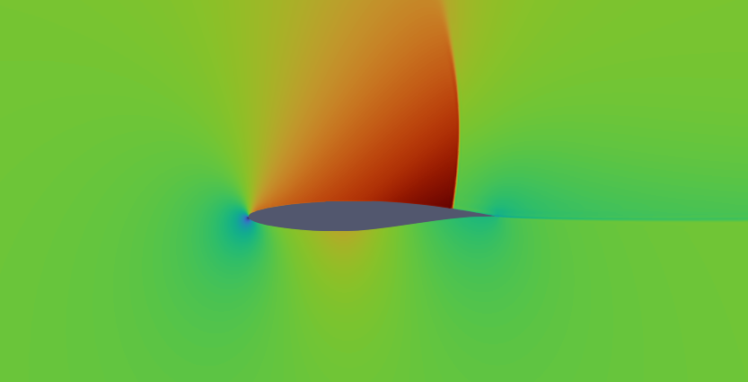
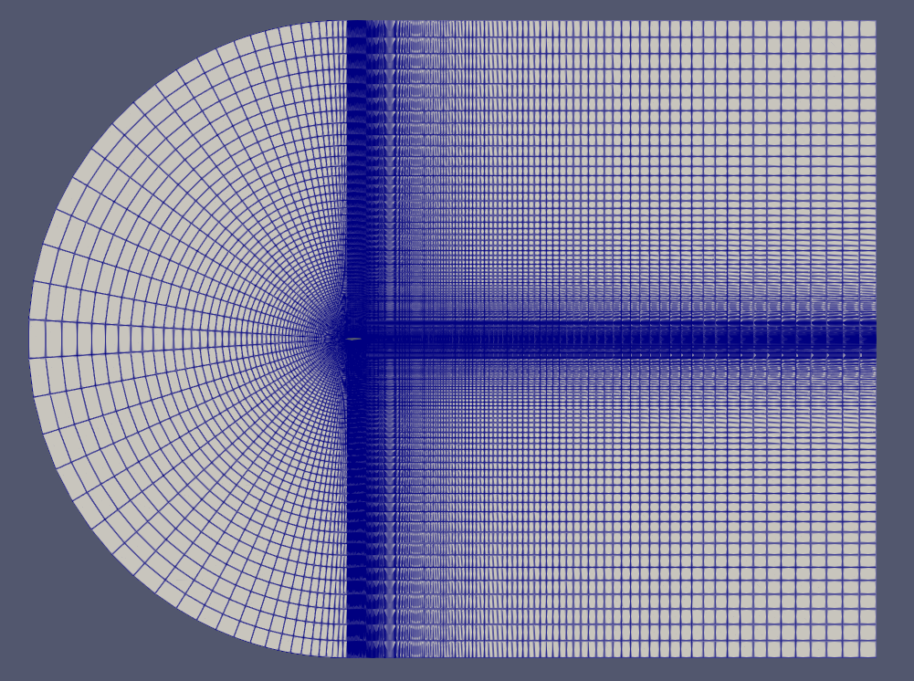

## wuFoil

wuFoil is an open sourced all in one airfoil modelling, analysis and optimization tool. The code automates the process of mesh generation using gmsh and aerodynamic analysis using either xfoil or SU2 allowing for operations such as optimization and rapid sampling for machine learning databases.

## Features

- Airfoil modelling from coordinate data files or CST Variables
- Automatic c-blockmesh generation with gmsh

  

- Automated Simulation runs in SU2 CFD or xfoil
- Airfoil Optimization
- Parallelized batch simulations