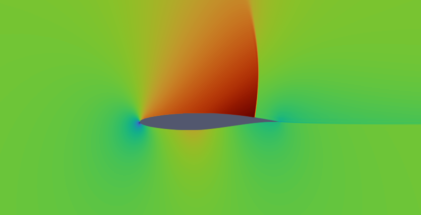
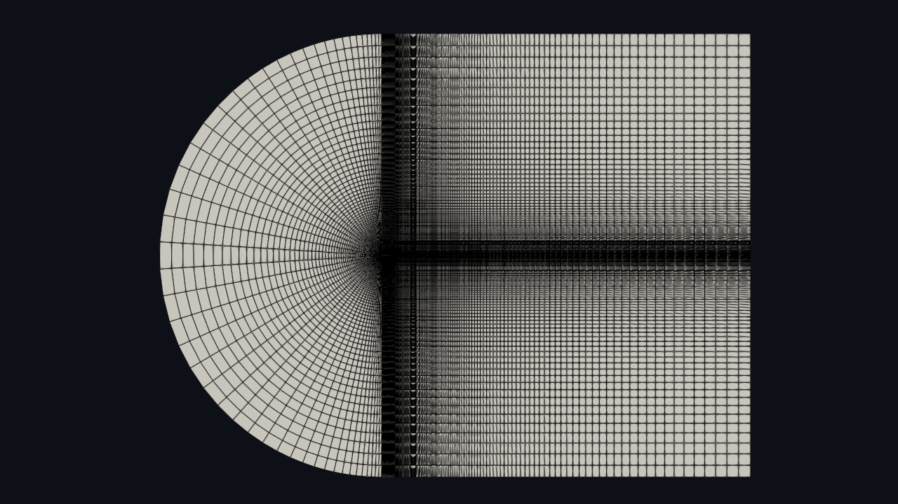

# wuFoil

wuFoil is an open sourced all in one airfoil modelling, analysis and optimization tool. The code automates the process 
of mesh generation using gmsh and aerodynamic analysis using either xfoil or SU2 allowing for operations such as 
optimization and rapid sampling for machine learning databases.

---
## Features

- Airfoil modelling from coordinate data files or CST Variables
- Automatic c-blockmesh generation with gmsh

   

- Automated Simulation runs in SU2 CFD or xfoil
- Airfoil Optimization
- Parallelized batch simulations

---
## Requirements
- [numpy](https://pypi.org/project/numpy/)
- [gmsh](https://pypi.org/project/gmsh/)
- [scipy](https://pypi.org/project/scipy/)
- [matplotlib](https://pypi.org/project/matplotlib/)
- [xfoil](https://web.mit.edu/drela/Public/web/xfoil/) (Make sure xfoil.exe file is in working directory)
- [SU2](https://su2code.github.io/) (make sure to set up SU2_RUN environment variable as mentioned in installation instructions [here](https://su2code.github.io/docs_v7/SU2-Windows/))

---
## Future Improvements
This project is still very much a work in progress. I am finishing up my phd right now so unfortunately I will not have too much time to work on this project for the next couple months, but the list of anticipated feautures to come is as follows
- Optimization: Its easy enough to run this code with gp_minimize from scikit-optimize or something similar, however I would like to add a built in Particle Swarm Optimization method. With parallel computation handling batches of airfoils, this method should be lightning fast
- Airfoil Parameterization Methods: CST Parameterization works well enough for optimization but lacks any real physical meaning. I plan on adding NURBS parameterization and possibly a few more methods
- Automatic Drag Polar Generation: Automatically generate drag polars. Will be added relatively soon